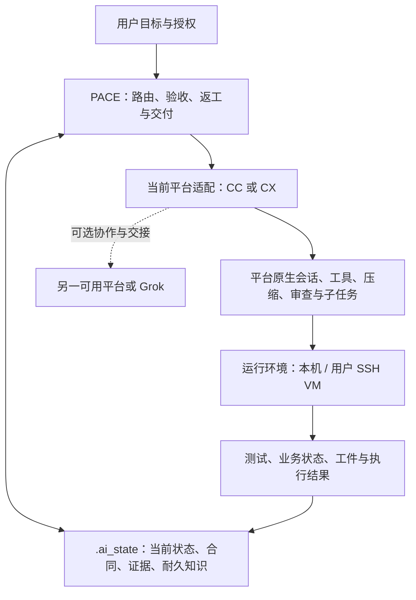

# Design — Athena 9.9.9：PACE + ai_state 的可靠执行闭环

## WHY 与版本边界

9.9.8 已建立薄 PACE、一次独立 review、有界索引和原生能力适配。本版解决合同漂移、单端隐式依赖另一平台、结果过期、运行环境不可复现、并行结果缺少整合与全栈旧流程回流。
所有切片统一归 9.9.9，不再拆成 9.10。用户授权本轮输出研究、设计、roadmap 与可独立挑战材料；实现、安装态更新、代码发布另属后续执行范围。
以 PACE 控制工作、.ai_state 保存状态/合同/证据，Skills/SubAgent/MCP 提供执行能力。源码组织与去重服务这两个核心；本版不把 Athena 重做成模型调度或插件开发平台。

## 必须成立的架构约束

1. **单平台基础**：CC-only、CX-only 均可完成适用的 PACE 全流程。相同平台的独立 reviewer/新上下文可以完成审查，不强制另一家厂商。
2. **多平台增强**：有明确收益且能力可用时才跨端研究、审查、并行或交接；始终有一个当前主平台负责整合与 .ai_state 写入。
3. **单一状态**：只使用现有 PACE stage 与 .ai_state，不加任务状态库、平台专属进度树或另一个续跑循环。
4. **单一验收**：design.md 的 Done Contract 是权威；checklist.yaml 存在才承担推进表，不成为另一份验收定义。
5. **诚实的结果**：代码、合同与适用环境匹配才可复用证据；未知执行状态不能当通过；review 与实际审查内容绑定。
6. **能力与权限分开**：CLI/模型/VM 可调用不等于任何副作用均获授权。原生权限与已授权目标继续适用。
7. **适度新增**：先复用现有 skills、模板、collector、gate 与 runtime-env；新字段必须有实际写者、消费者和失效条件。

## 系统架构



PACE 不接管厂商 agent loop；.ai_state 不复制全部聊天。runner 不拥有项目真相，故障只影响其承担的验证。供应商内部推理基础设施、公开工具执行沙箱与用户 VM 的边界详见 vm-design.md。
正式发行仍为 CC/CX；Grok 本次作为受邀研究者和未来可选协作适配对象。只有新增对应发行包并通过单端验收后，才能宣称 Grok-only 受支持。

## PACE：一致的流程与有界工作

| Path | 适用流程 | 本版校正 |
|---|---|---|
| Hotfix | 必要修复/验证 → ship | 保留紧急例外，不伪造设计与测试 |
| Quick | 简短计划/验收 → impl → 合适验证 → 风险所需 review → ship | 小任务不被可选文档、另一平台或 VM 阻塞 |
| Bugfix | 复现/定位 → impl → 回归 → 一次 review → ship | 修复证据与原问题关联，测试可合理修订但需可审查 |
| Feature | design/packet → impl → 必要运行验证 → 一次 review → ship | 无固定设计自审，Done Contract 只有一份 |
| Refactor/System | plan/design → impl → runtime-verify → polish → 一次 review → ship | 最终代码清理在审查前；保留独立设计挑战 |

根入口只写协作原则和导航；每端 pace/references/stages.md 是该发行包内阶段义务的唯一正文。agent、skill description 和模板消费其约定，不再各写一套相反的步骤。两端用同一组行为预期验证语义，原生语法各自维护。
brainstorm 在足以形成可观察验收时结束，不固定“再问三个”；roadmap 复用可独立验收切片及 items.yaml 的 blocked_by，模块数只辅助风险判断。
原生 review 入口可用则优先；否则使用当前平台可验证的只读 reviewer/独立会话。依赖另一平台的 fallback 禁止成为唯一通道。若当前环境连独立审查能力也不存在，缺的是所需能力，不能伪造审查通过。
实际异步入口才进入 await-review-result；等待不重复派发、不用 Stop 无限续跑。结果从当前平台支持的通知/等待/显式回读恢复；丢失结果保持未完成。代码变化触发针对性复核；同因反复失败按现行终止规则处理。
派发与接收按 execution-contracts.md 的最小绑定记录执行：扩展现有 review-manifest/session-log，核对 run、packet、实际输入与证据引用；过期回调保留为历史，不能覆盖当前结果。
验证通过后，只因新增变更、失败或未消除风险扩大/重复检查。影响范围不能可靠判断时保守复验，不靠“省 token”跳过所需证据。

## ai_state：状态可恢复，证据有范围

| 数据 | 唯一职责 | 本版增量 |
|---|---|---|
| _index.md | 当前 path/stage/sprint/roadmap、next_action、权威指针 | 保持 ≤12 KiB、列表 ≤10、条目 ≤160 B；修复溢出与原子更新、空更新不写 |
| design.md | 目标、决策、Done Contract | 需求变化后原位修订，并使相关派生材料失效 |
| review-packet.md | 从 design 派生的有界审查入口 | hash + AC 集双射；≤80 行；不复制全部设计 |
| evidence.yaml / runtime-verify.md | 运行结果、场景覆盖和环境说明 | collector 自动记录必要输入绑定；主 agent 补覆盖映射，不手造账本 |
| session-log.md | 中断/交接后的最短恢复信息 | 复用已有文件，包含目标、代码状态引用、已知失败、下一动作 |
| requirements/architecture/compound | 耐久需求、实际架构与经验 | proposed / accepted / superseded 明确；旧经验不能覆盖新决定 |
| archive / .runtime | 冷历史 / 可重建运行信息 | 不默认全扫；不重新引入本地 token 遥测 |

stage 等操作字段在必要转换时更新，收尾集中写结论；不能把“只在 ship 同步”解释为整个实现阶段状态不变。所有索引修改经过现有串行/锁机制，溢出目标与指针更新纳入同一事务边界，崩溃不丢原文。
恢复最短路径：_index → 当前合同及必要恢复摘要 → 实际 Git/worktree → 相关证据 → 下一未完成动作。接收平台不得仅凭上一模型说“通过”恢复完成状态。
验证记录应绑定：被测代码内容、被验收合同、实际使用的非敏感环境摘要及输出引用。优先扩展现有记录，字段由执行采集方生成。秘密不进入摘要或 hash 输入；新加字段先与旧 schema 兼容。
证据复用按验证对象判断：业务应用测试可跨模型消费；原生 hook/平台协议测试不能拿 CC 结果代替 CX。代码/合同/环境相关部分变化后重验，来源缺失或读取失败显式不可验证。

## 单平台与多平台的能力选择

| 场景 | 运行策略 |
|---|---|
| 只有 CC | 仅安装 CC 受管资产；CC 原生能力 + Athena 完成闭环 |
| 只有 CX | 仅安装 CX 受管资产；CX 原生能力 + Athena 完成闭环 |
| 两端可用 | 当前主端负责状态与整合，可把独立任务交给另一端；不默认每步双跑 |
| 协作端失联/不支持能力 | 保留其实际进度；在主端合法可用路径继续，未完成任务不能冒充完成 |
| 没有 VM | 本地满足项目合同即可；不要求用户配置或购买 VM |
| required 环境不可用 | 仅相关验收缺失；暂停其交付，继续不依赖该环境的授权工作 |

安装选择是用户意图，能力探测是事实；二者不得混为“检测到就启用”。platforms_enabled 读取兼容旧 ["both"]，新写采用 ["cc"] / ["cx"] / ["cc","cx"]；明确选单端时不检查另一端账号。
动态能力可在 ignored .runtime 保存带版本/checked_at 的可重建缓存；_index 现有字段先保持兼容，查清消费者后再迁移。必需的红区控制不能因能力探测失败而静默跳过；可选增强缺失不升级为交付门禁。
模型选择遵循用户有效配置与实际账号能力；不写“CC 永远规划/CX 永远实现/Grok 永远审查”。平台差异引用原生文档并在实施入口实测。

## 复杂任务：依赖、写集、整合与交接

复用 roadmap/items.yaml 的 blocked_by。设计与原生派工消息描述基线、输入引用、允许写集、绝对工作目录、输出与验收；不新增 CODEX-TASK.md、任务数据库或通用调度算法。
主 agent 先准备包含实际待改内容的 worktree，再派 writer；CC/CX 按自身真实工具实现隔离。当前 writer 的真实 agent_id 绑定继续保留，已绑定任务可以并行；只读任务不套用写者记账。
原生消息不是唯一恢复点：assignment ledger 保留既有身份合同；session-log 通过真实 ID 关联基线、绝对 worktree、写集、产物校验值与唯一整合者，具体字段及恢复动作见 execution-contracts.md。
共享 schema、锁文件、索引和集成分支指定单一写者。多个 writer 的工作树通过不等于完成；主 agent 整合后核对全局不变量与相关测试，再交独立 reviewer。
跨端交接消费同一份合同及代码工件。记录可访问的 commit/增量载体与校验值；接收端核实基线和未提交文件，不能假定另一个工具会继承私有会话或工作树。
增加中断/恢复演练：在明确边界中断后，由同端新会话或另一已授权平台定位正确状态继续；不重复创建任务，不丢改动，不以“历史 PASS”跳过失效证据。

## VM 与全栈交付

本版 VM 协议复用已有 athena-vm 与 runtime-env，先支持 local + SSH。配置存在、SSH 可达、项目场景 ready 分开判断；只有设计要求的目标环境才构成 required 验收。细则与本轮只读观察见 vm-design.md。
runner 生命周期为选场景 → 核对代码 → 准备环境 → 执行断言 → 回传证据 → teardown → 返回 PACE。其退出、超时、未知结果与清理失败均有明确归属；只清理本 run 的资源。
回放依据是代码/合同/环境配方/数据种子/断言；VM 快照仅在真实支持时使用，不新造 hypervisor 能力。环境可丢弃，项目合同与证据不应随之丢失。
全栈复用 biz-delivery-loop、quantum-codegen(page/module/db/unit/security/e2e)、quantum-data、项目 Convention Pack。单平台也能按依赖完成全部环节；有并行收益时再委派独立部分。
业务垂直切片例：员工申请 → 审批通过/驳回 → 前端状态更新 → 权限/审计可核对。每个切片含必要 UI、API、DB 和断言；保留表设计与 DDL SQL 分离交付，涉及迁移才增加兼容/回滚验证。
先明确业务规则和接口合同，再按依赖并行前后端与数据实现；集成后真实运行 FE/BE/DB，覆盖正常、拒绝、越权和失败路径。已有确认不重复询问；新业务决策按其影响处理。
切片5实施前必须完成 execution-contracts.md 的真实项目准入记录；缺合格目标则 AC11 保持阻塞，不能缩成 mock 或文档验收。
交付报告从同一组“需求 → 产物 → 证据 → 状态/遗留”引用生成；模型用量能取得则记录，不能取得标 unavailable，不能因缺用量数据阻塞功能交付。

## 文件结构与变更面

```text
vibeCoding/{claude,codex}/9.9.9/       # 各自可安装的原生发行件
  .claude/ 或 .codex/
    CLAUDE.md 或 AGENTS.md           # 协作原则与 PACE/state 导航
    skills/pace/                    # 唯一阶段义务、平台编排、state 模板
    skills/athena-{init,setup,migrate,vm,runtime-verify}/
    skills/{brainstorm,roadmap,polish,athena-review,biz-delivery-loop}/
    agents/                         # 修复合同来源与退役角色
    hooks/                          # 必要证据、索引、交付边界
vibeCoding/scripts/
  validate-athena-9.9.9.py            # 计划新增；本轮未实现
  fixtures/athena-9.9.9/             # 双端共享行为预期与故障案例
.ai_state/
  _index.md                         # 现有入口，兼容演进
  roadmap/athena-9-9-9/              # 本版切片
  sprints/2026-09-06-athena-9-9-9/    # 设计、研究、VM方案与派生packet
```

本版不引入全量共源编译层。先消除包内义务副本，使用共享行为 fixture 校验双端；真正需要共享的纯函数可逐项提取，避免大搬目录挤占 PACE/state/VM 交付。
迁移先生成受管改动预览、逐文件备份、事务写入与回读；保留用户模型/effort、provider、权限、第三方 hooks/skills。旧 ["both"] 和旧状态字段可读；失败可回滚；历史 9.9.8 不改写。
前一轮 brainstorm 的 9.10 与共源框架建议由本设计取代。研究与取舍见 research.md；工程执行顺序见 ../../roadmap/athena-9-9-9/roadmap.md。

## Done Contract

以下是实施期验收目标，不是本轮已通过的测试。对应脚本/fixture 需在实现切片中产生；发布前运行真实场景并由 delivery-gate 核验。
| ID | 必须成立 | 可观察检查 |
|---|---|---|
| AC1 | CC-only / CX-only 都可独立闭环 | 隔离另一端 CLI/配置后分别执行代表任务；无另一端账号或模型调用，无无关平台缺失门禁 |
| AC2 | 多平台只增强且安装尊重选择 | 单端选择不探测另一端认证；双端协作失联可回到可用本端，未完成结果不被接受 |
| AC3 | PACE 全消费者一致 | 无 checklist 的 Feature 可按 design 完成；R/S 先 polish 后 review；biz 不调旧三件套；roadmap 不按模块数单独触发 |
| AC4 | state 有界、原子、可恢复 | ≤12KiB/10条/160B；并发与溢出故障注入不丢原文；空更新零写；原指针能解析 |
| AC5 | 同端恢复与跨端交接正确 | 中断后找到实际基线、未提交改动与剩余动作；缺输入不宣称完成，不重建第二状态树 |
| AC6 | 证据绑定实际输入 | 改代码/合同/相关环境使原记录失效；缺来源/git失败为不可验证；有效业务证据可跨平台复用 |
| AC7 | 一次独立 review 绑定最终内容 | 本端 reviewer 可完成；缺失/错run/旧packet/输入变化不通过；接收者现场匹配持久派发记录；红区控制不被异步化 |
| AC8 | 并行结果经过整合验证 | 两个互斥 writer + 共享文件单写者，整合后测试；中断后从持久记录定位冲突归属、产物与整合者；真实id不凭名称猜 |
| AC9 | VM 传输与场景就绪可区分 | 配置有但不通、通但服务未 ready、未提交输入不同步、超时清理等案例得到正确结果 |
| AC10 | VM 执行可回放且不全局必需 | 本机与 dev RHEL 实跑承诺场景并回传/清理；无VM项目可本地闭环；required OS缺失不能假通过 |
| AC11 | 全栈垂直切片可用 | 真实 FE/BE/DB/权限链；正常/拒绝/越权/失败可核对；表设计和DDL、需求-证据映射齐全 |
| AC12 | 发布与迁移诚实兼容 | 单端/双端首装与9.9.8迁移回滚；用户覆盖保留；旧both可读；无受管重复入口；RELEASE/模板状态一致 |
| AC13 | 行为质量与效率有基线 | 按 eval-plan.md 预注册任务/条件/来源；质量不回退；非必要往返不增加；有重复工作的基线按预定规则减少，无自建遥测 |
| AC14 | 承重平台能力逐端实测 | 保存平台/版本/入口和关键hook、review、worktree、VM结果；文档或探测未知不冒充支持；不依赖Grok才完成 |

## 风险、评测与取舍

先用独立预期 fixture 覆盖合同/异常，再跑少量代表性真实任务；来源于实际回归的案例永久保留。质量下降时先定位规则、环境与模型变量，不用更多固定审议轮次补偿。
对比 9.9.8 与候选版时固定模型/effort、仓库、任务、权限及可控制的环境资源；记录冷/暖缓存条件。主张减少重复流程需同时报告达标率与返工，不能只报速度。[环境资源会影响 agent 评测](https://www.anthropic.com/engineering/infrastructure-noise)。
eval-plan.md 定义本版任务矩阵、采集来源、比较窗口及发布判断；基线在切片1前开始冻结，未取得测量时不能声明效率提升。
VM/SSH 不是生产部署工具；只读数据能力不扩为业务写权限。LaaV/多候选评分、向量检索、通用runner市场、自动生产发布与全局多平台审议不进入本版默认链。
独立审查检查的是当前设计与证据边界；本轮文档通过不代表 AC1–AC14 实现完成，也不代替后续 runtime-verify、polish、implementation review 和 ship。
